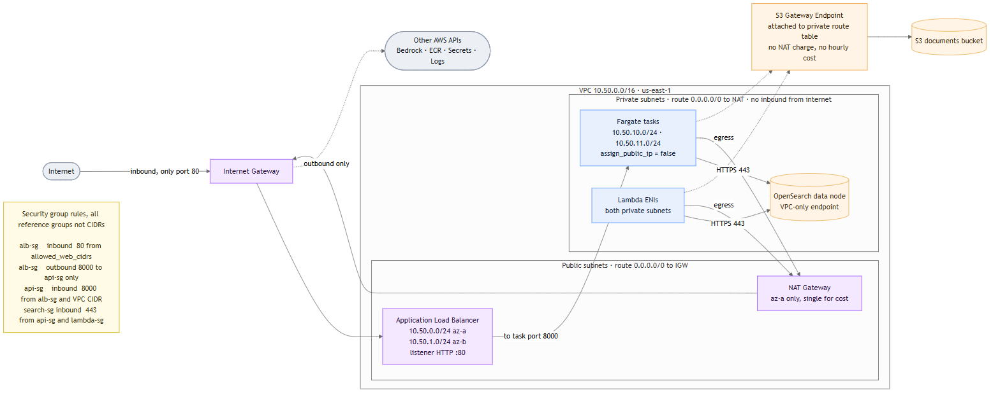
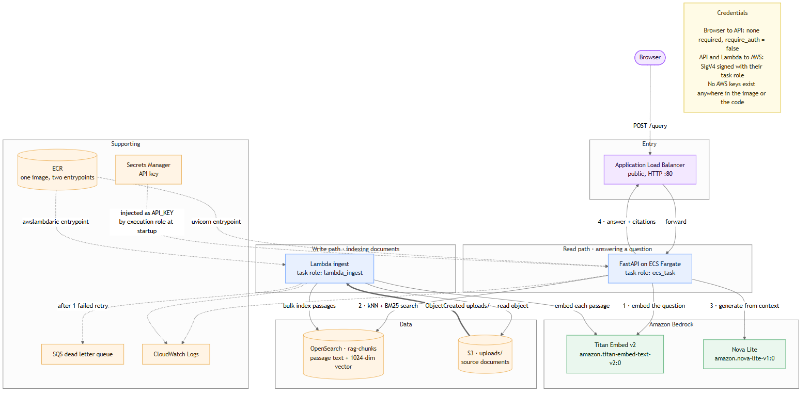
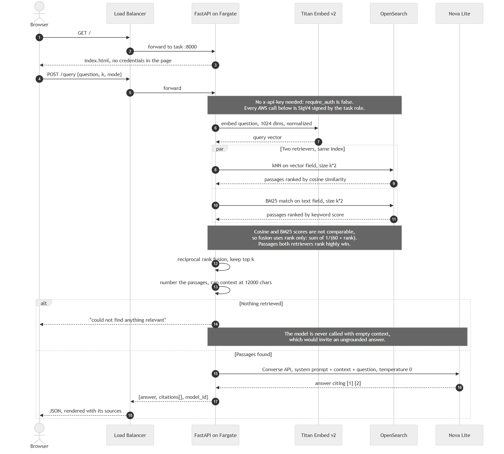
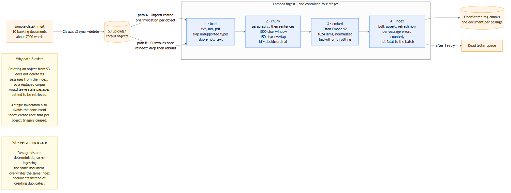
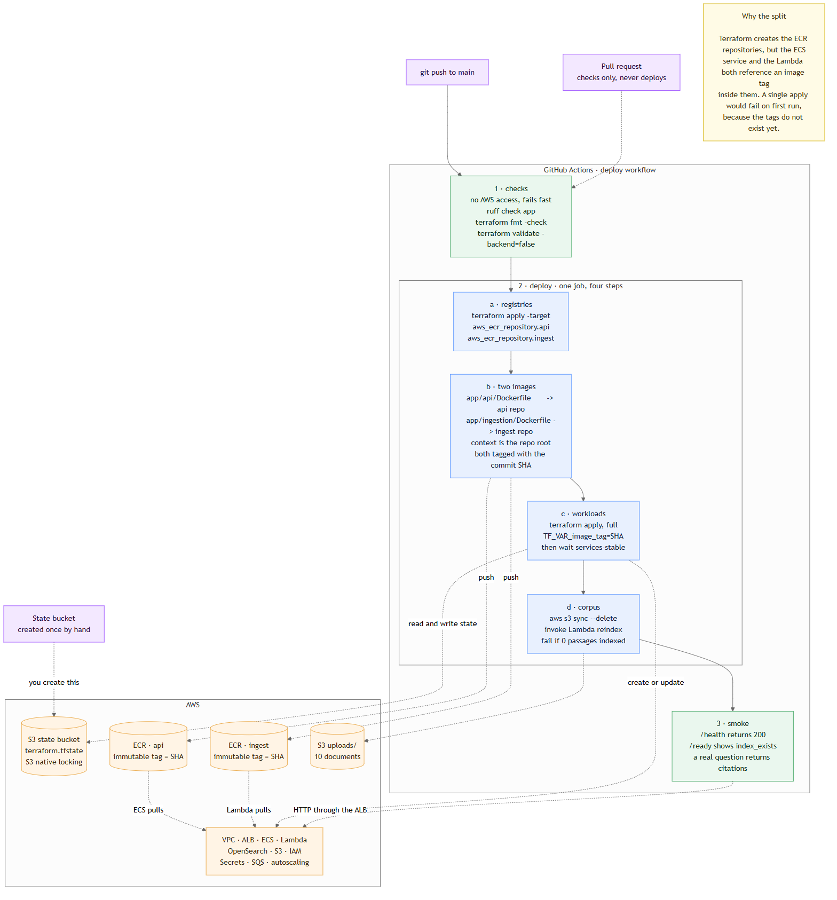

# Architecture

Five diagrams, each answering one question. Sources are Mermaid text in
`docs/diagrams/*.mmd`; PNG and SVG are rendered from them and committed so they
display here without any tooling.

Regenerate after editing a source:

```powershell
powershell -ExecutionPolicy Bypass -File docs/render-diagrams.ps1
```

The script renders every `.mmd` to both formats. It drives Mermaid CLI through
headless Chrome, using the Chrome or Edge already installed rather than
downloading a Chromium, which is why it needs no Graphviz and no extra setup.

---

## 1. Where things sit, and what may talk to what



One VPC, `10.50.0.0/16`, across two availability zones.

Only the load balancer is reachable from the internet. Fargate tasks, the Lambda
ENIs, and the OpenSearch node all sit in private subnets with
`assign_public_ip = false`, so nothing can dial them from outside. Their
outbound calls leave through the NAT gateway.

Two details worth noticing. S3 traffic uses a gateway endpoint rather than the
NAT, which costs nothing hourly and avoids NAT data processing charges. And
security groups reference each other rather than IP ranges, so "OpenSearch
accepts traffic from the API" stays true even if subnets are later reused for
something else.

There is a single NAT gateway, in one AZ, to keep cost down. That is a
deliberate development trade-off: losing that AZ cuts egress for the whole
workload. Production should run one per AZ.

---

## 2. Which service calls which, and with what credential



Separating the read path from the write path is the useful way to look at this.

**Read path.** A question arrives at the load balancer, reaches FastAPI, and
fans out to three calls: embed the question, search the index, generate the
answer.

**Write path.** An upload to S3 fires an event, the Lambda reads the object,
embeds the passages, and writes them to the same index the read path queries.

The two paths hold separate IAM roles. The API may read the index and call the
models; the Lambda may read documents and write the index. Neither carries the
other's permissions.

One image serves both, with different entrypoints: `uvicorn` under ECS,
`awslambdaric` under Lambda. The application code is therefore identical in both
places, which removes a whole class of "works in the API, fails in ingestion"
bug.

No AWS credentials exist in the image or the code. Every AWS call is SigV4
signed from the task role. That is what "Bedrock connects automatically" means,
and it is a different question from whether a browser needs a key to call your
API.

---

## 3. How a question becomes an answer



The interesting step is fusion. Two retrievers run against the same index: k-NN
on the embedding vector, and BM25 on the passage text. Vector search handles
paraphrase, keyword search handles exact rare tokens such as `t3.small.search`
or a specific threshold. Most questions benefit from one or the other, and you
cannot tell which in advance.

Their scores cannot be compared: cosine similarity sits near zero to one, BM25
is unbounded and shifts with corpus statistics. Normalising them requires
choosing a weight, and any fixed weight is wrong for some queries. So fusion
discards the scores and uses rank alone, summing `1 / (60 + rank)` across both
lists. A passage both retrievers rank highly beats one that only a single
retriever loved, which is the behaviour you want, because agreement between
independent methods is evidence.

If retrieval returns nothing, the model is never called. Handing an LLM an empty
context invites a confident answer from memory alone, which is the worst failure
mode for a system whose value is being grounded in your documents.

---

## 4. How documents become searchable passages



Load, chunk, embed, index. Chunking packs sentences into a 1000 character window
with 150 characters of overlap; the overlap protects facts that would otherwise
straddle a boundary and retrieve poorly from either side.

There are two ways in. Path A is the S3 event, one invocation per uploaded
object, which is what happens when someone drops a file in the bucket. Path B is
an explicit reindex the pipeline invokes, which drops the index and rebuilds it
from the bucket in a single call.

Path B exists because deleting an object from S3 does not delete its passages
from the index. Without it, replacing the corpus leaves the old passages behind
to keep surfacing in answers. It also sidesteps a race that path A hit in
practice: seven concurrent invocations each checked whether the index existed,
all saw "no", and all tried to create it, so one won and the rest crashed with
`resource_already_exists_exception`. `ensure_index` now treats that specific
error as success, and one invocation avoids the contention entirely.

Passage ids are deterministic, `docId::ordinal`, so re-ingesting a document
overwrites the same index documents instead of duplicating them.

---

## 5. How a push reaches production



Six jobs, cheapest checks first. Lint and validate need no AWS access at all,
so a typo fails in under a minute without touching the account.

`bootstrap` then proves the credentials work and creates the hardened state
bucket, and publishes the two settings the later jobs need: the bucket name and
whether to seed the corpus. Deciding both in one place is what keeps the rest of
the file short, since no other job has to derive them.

`deploy` is a single job that applies in three phases, for a specific reason:
Terraform creates the ECR repository, but the ECS service and the Lambda both
reference an image tag inside it, and a single apply fails on first run because
the tag does not exist yet. So it applies only the repository, pushes an image
tagged with the commit SHA, then applies everything else pointing at that tag.
That is step ordering rather than a reason for separate jobs, so it authenticates
and runs `terraform init` once, and the environment approval gate covers the
whole deployment instead of only its last phase.

Because tags are immutable and equal to the commit SHA, the running code is
never ambiguous, and rollback is redeploying a known tag.

Seeding the corpus is optional. Set the `SEED_CORPUS` repository variable to
`false`, or untick "Seed the corpus" on a manual run, when you manage the
documents in the bucket yourself: the sync and reindex steps are skipped and
whatever is already indexed is left untouched. Nothing in the running service
depends on them, so the deployment is unaffected either way.

The last job earns its place. It asserts the load balancer returns 200 and the
UI is actually being served. When this run seeded the corpus, it additionally
requires a populated index and a real question coming back with citations, which
covers the whole path end to end: S3 event, Lambda, embeddings, OpenSearch k-NN,
and generation. A deployment that starts cleanly but cannot answer anything fails
the build. With seeding turned off there is nothing to promise about the index,
so an empty one is reported as a notice and the retrieval check is skipped.

---

## Current configuration worth knowing

| Setting | Value | Note |
| --- | --- | --- |
| `require_auth` | `false` | `/query` is open to anyone who can reach the ALB |
| `allowed_web_cidrs` | `0.0.0.0/0` | The only access control while auth is off |
| ALB listener | HTTP :80 | No certificate, so traffic is unencrypted |
| `opensearch_instance_count` | 1 | No redundancy; a node loss is an outage |
| `api_desired_count` | 1 | Autoscales to 4 on CPU |
| NAT gateways | 1 | Single AZ egress |

The first three combine into a real exposure: an open, unencrypted endpoint that
spends Bedrock tokens on your account for every question asked. Narrowing
`allowed_web_cidrs` to your own address is the one change worth making before
leaving this running:

```bash
terraform apply -var 'allowed_web_cidrs=["YOUR.IP.HERE/32"]'
```
